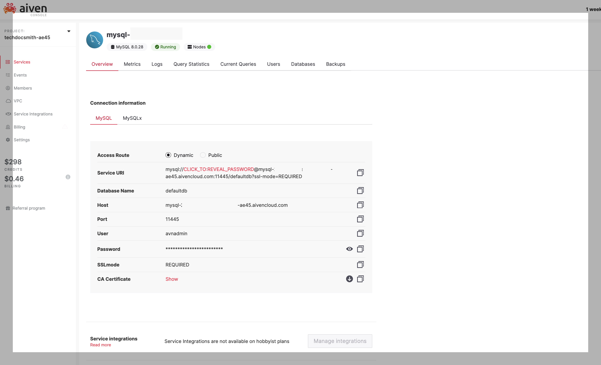
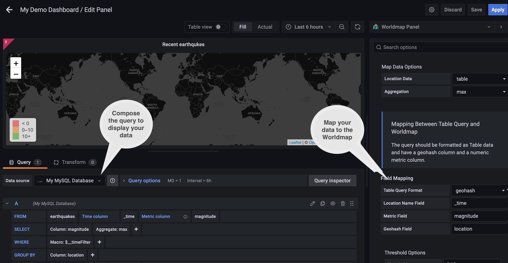
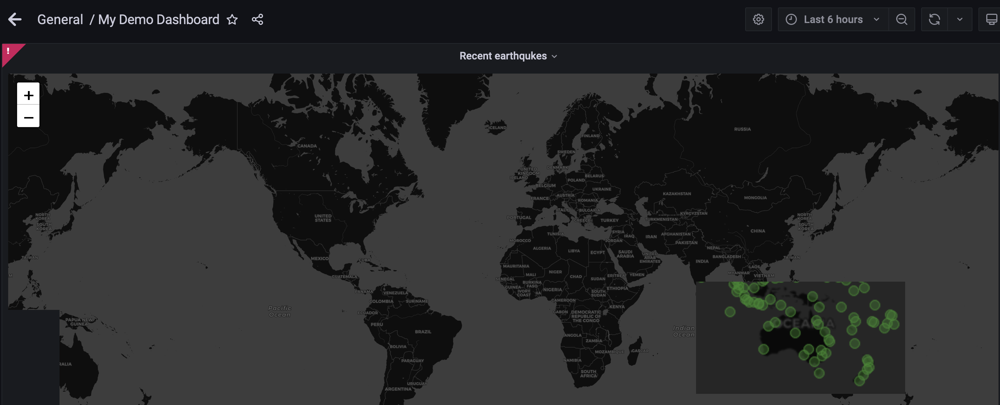

#  Taking the Grafana Worldmap for a whirl

My friends at Aiven recently challenged me to pick my favorite Grafana plugin from the wide array of [Grafana plugins](/docs/products/grafana/reference/plugins.html) they distribute with their platform.

If you're not familiar with [Grafana](https://grafana.com/), it's a powerful open source observability and visualization tool. The great thing about Grafana is that you can create dashboards that you can later embed in your own app. The great thing about Aiven is they let you enable Grafana with the flip of a switch. Pretty cool!

## We have a winner
<!-- Default Worldmap panel from docs-->


Aiven supports a wide array of Grafana plugins, but for me there was an obvious winner: the [Worldmap panel visualization](https://github.com/grafana/worldmap-panel). I'm a huge map fan and I find they can really make strong impact to deliver location-based data. They're also really fun to work with.

To test-drive the Worldmap panel I decided to plot out recent earthquakes with geographic data from the US Geologial Survey (USGS). But you could use the Worldmap for all kinds of geospatial data:
- Use monitoring data with geographic information to locate an outage.
- Compare sales data for a region for a specific campaign.
- With GPS data from your shipping fleet, track your ships' locations.
- Using public data on pandemics, map out the most impacted regions for an outbreak.

## How does the Worldmap plugin work?

The Worldmap plugin comes installed with Aiven's distribution of Grafana, so there's nothing to install.

To use the Worldmap visualization, you need some data in either time series format or in tabular format. Be sure to check the [supported databases](https://github.com/grafana/worldmap-panel#time-series-data-as-the-data-source) to make sure your data source is compatible.

Here's what I did to try out the plugin. There's some sample data in case you want to follow along at home.
<!--Ed. note instructions aren't click-by-click detail. Could add later.-->

### Connect Grafana to MySQL

For my earthquake mapping scenario, I'm using MySQL table as the data source.  The awesome thing about the Aiven Console, is the MySQL Service **Overview** tab has all the information I need to securely connect Grafana to my MySQL instance.
I can copy and paste all configuration items. A couple of notes on My SQL Configuration:
- My time series data doesn't have a primary key, so I turned off the primary key requirement in **Advanced configuration**: `mysql.sql_require_primary_key: Disabled`.
- Grafana uses `host:port` format for the **Host**, so make sure to include the port there.
- Also, for demo purposes, I'm using the `avnadmin` user. In production, make sure to create a read only user for Grafana.
<!--Ed note: This didn't work in my Aiven platform environment, but did work in a local Grafana-->

See [Using MySQL in Grafana](https://grafana.com/docs/grafana/latest/datasources/mysql/) for more info about setting up a MySQL datasource within Grafana.

### Add some quake data in MySQL

The Worldmap requires a location and a metric. I'm using a geohash for the location and the magnitude for the metric. I'm also using event time. For example:

```
{'magnitude': 1.11,
'location': 'hb5842j8h812',
'time': '2022-08-31 00:16:31.050000'}
```

You can run the following SQL commands to create an `earthquakes` table and load a few events:

<!--Ed note: Grafana is throwing erorrs with this data. Need to do more research.-->
Create the earthquakes table:
```
 CREATE TABLE IF NOT EXISTS earthquakes
    (_time TIMESTAMP,
    magnitude FLOAT(3,2),
    location VARCHAR(32))
```

Insert some earthquake events:
```
 INSERT INTO earthquakes
    (_time, magnitude, location)
    VALUES ('2022-08-31 00:18:02.490000',1.87, 'hb12080b02j8'),
    ('2022-08-31 00:16:31.050000',0.61, 'h8pbp002n202'),
    ('2022-08-31 00:16:11.300000',0.94, 'hb08jbj2p212'),
    ('2022-08-31 00:12:46.580000',0.85, 'hb5850004b50'),
    ('2022-08-31 00:07:53.650000',0.94, 'hb5852n81000'),
    ('2022-08-31 00:07:16.640000',1.15, 'hb584bp05b10'),
    ('2022-08-31 00:06:26.390000',1.16, 'hb584bp85210'),
    ('2022-08-31 00:05:43.410000',1.14, 'hb584b5058h8'),
    ('2022-08-31 00:04:33.180000',2.18, 'hb584bj01b02'),
    ('2022-08-31 00:03:32.800000',1.15, 'hb584bhb1bn8'),
    ('2022-08-31 00:03:32.350000',1.11, 'hb5842j8h812')
```

### Create a dashboard with a Worldmap

Now that I've connected Grafana to MySQL and the earthquake tables has some data, I'm ready to create a dashboard with my Worldmap.

There are some things to be aware of when setting up a Worldmap. The **Worldmap** tab on the right has the **Map Visual Options** where you can control how the location points appear on your map. But it also contains the **Map Data Options** to configure the map for your data. See Grafana's docs for details about [Map data options](https://github.com/grafana/worldmap-panel#map-data-options-for-time-series-data).

<!--Ed note: Fix screen shot with corrected data-->


For my earthquake data I used the following settings:
- **Location Data**: table
- **Aggregation**: max
- **Metric field**: magnitude
- **Geohash Field**: location

In the query section, I modeled my query after the one in the Grafana docs. The query aliases `_time` to the time column and `magnitude` to the metric column. It groups by `location`.

<!-- Ed note: Assmuming that's you should need.-->

And that's it. Here's a map displaying the earthquake data:



## What's next

If you're new to Grafana, take some time to check out their [tutorials](https://grafana.com/tutorials/?utm_source=grafana_gettingstarted).

Fore more information on working with timeseries data in Grafana, try out the [Histogram](https://docs.aiven.io/docs/products/grafana/reference/plugins.html) and [Time series](https://grafana.com/docs/grafana/latest/visualizations/time-series/) plugins.

If you're looking for some sample data, the USGS makes lots of [time series data](https://www.usgs.gov/search?keywords=time-series%20data) publicly available. 